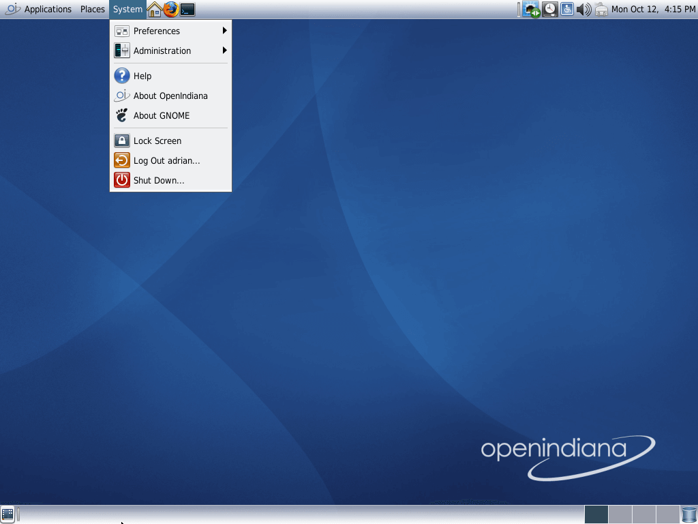
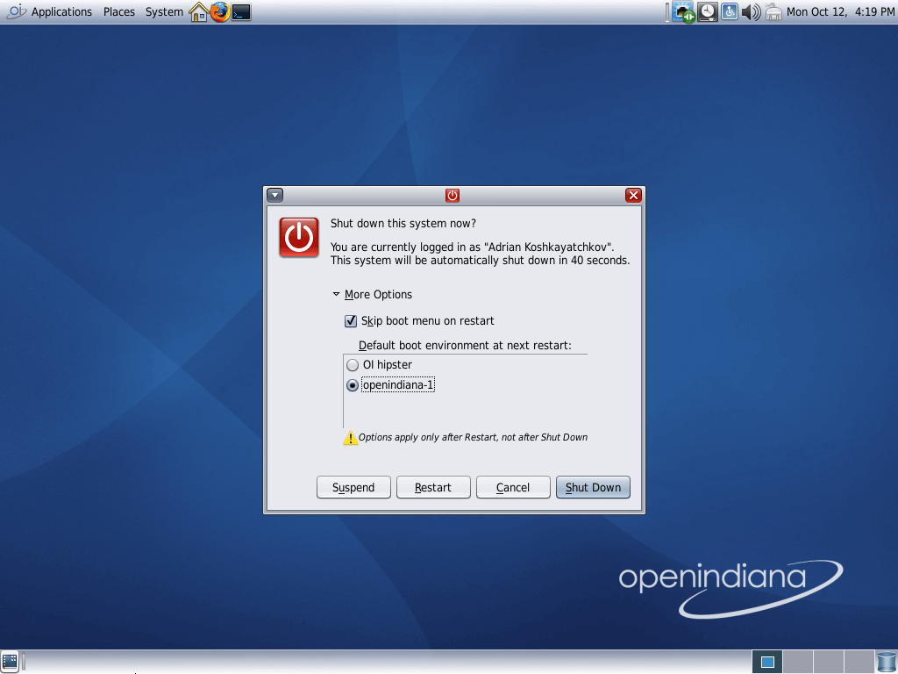
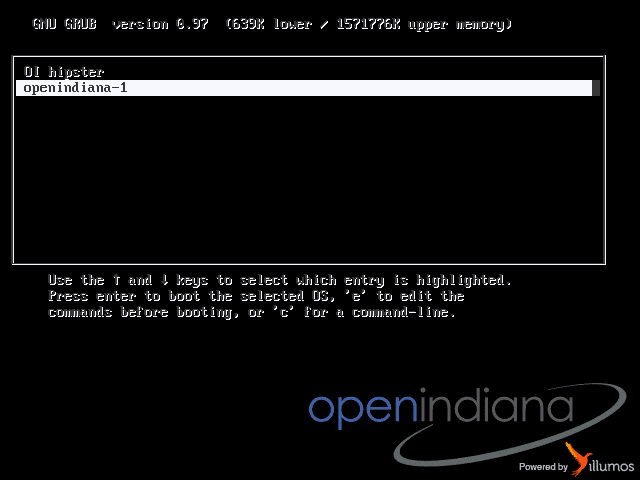

# Booting into a new system image.

You can have multiple snapshots of / in OpenIndiana thanks to ZFS, a typical
use case for needing to boot into a new image is after pkg updates

* Goto the ```System``` menu,
  * Press ```Shut Down...```



* Press the arrow next to ```More Options```
  * Select ```openindiana-1```



* Press ```Restart```

* Be sure "openindiana-1" is selected in the boot menu.



* Wait for it to boot, and you should be in your shiny new updated system.

[](https://www.youtube.com/watch?v=NdWwEP2vfQE)
