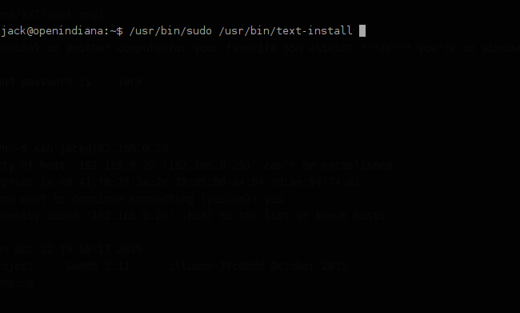

# Installing OpenIndiana via the text install and ssh

## Boot and setup

In the ```boot menu```, select ```OI hipster Enable SSH```


When you get to the desktop open a ```terminal``` and enter

```bash
ifconfig | grep inet
```

This should ```print``` something like

```bash
inet 127.0.0.1 netmask ff000000
inet 192.168.0.20 netmask ffffff00 broadcast 192.168.0.255 # could be 10.0.0.x or another IP range.
inet6 ::1/128
inet6 fe80::a00:27ff:fe1f:41e4/10
```


## SSH and install start.

Next open a ```terminal``` on another computer(or your favorite ```ssh``` client ***IF*** you're on windows) and connect.

- The ```username``` and ```password``` is ```jack```.

```bash
adrian@am1m-s2h:~$ ssh jack@192.168.0.20
The authenticity of host '192.168.0.20 (192.168.0.20)' can't be established.
RSA key fingerprint is c9:41:f8:75:3a:2c:78:d5:b0:a4:04:7d:ae:94:74:a1.
Are you sure you want to continue connecting (yes/no)? yes
Warning: Permanently added '192.168.0.20' (RSA) to the list of known hosts.
Password:
Last login: Mon Oct 12 19:58:17 2015
The Illumos Project     SunOS 5.11      illumos-7fc68dd October 2015
jack@openindiana:~$
```


Now that you're ```sshed``` into the OpenIndiana ```live``` system you can initiate the ```text install```.

To do so etner:

```bash
jack@openindiana:~$ /usr/bin/sudo /usr/bin/text-install
```

You will be prompted for a ```password```, the password is ```openindiana```




Take a moment to read if you need to and when you're ready press ```F2``` to continue.


## Disk partitioning/management

Now you can ```partition``` your ```drive``` or just use the whole drive. (use ```arrow``` keys to navigate menus)


## Network setup

Now you can setup your ```hostname```(Computer Name) and how your ```network``` is setup.


## Region, location, and time zone

Now you have to select your ```Region```


your ```location```


your ```time zone```


and finally make sure the ```date``` and ```time``` is correct


## User and Root details


## Installation Summary


Press ```F2``` to install and wait!


You can now press ```F8``` to reboot into your shiny new system, ```F4``` to view the log, and ```F9``` to quit.

## asciinema video

[](https://asciinema.org/a/2trhadpsleybvx0dt1ucekrlz)
